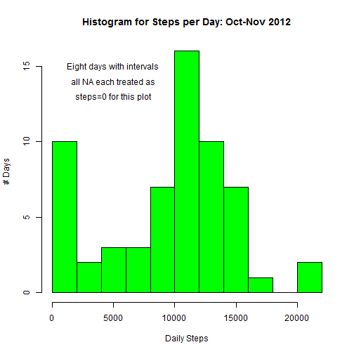

  
# Are there interesting patterns in FitBit activity data?
The overall objective of this code is to evaluate patterns in the average steps taken by a FitBit user in Fall 2012.  We are especially interested to understand steps per day, steps per time of day, and variability based on whether it is a weekend or a weekday.  Additionally, we want to understand how missing data (NA) impacts some of the findings.

  
## Data Source and Background
This RMarkdown reads in FitBit activity data originally obtained on February 9, 2016 from [cloudfront.net link](https://d396qusza40orc.cloudfront.net/repdata%2Fdata%2Factivity.zip).  The raw data has 17,568 rows, each containing the number of steps taken during a 5-minute interval between October 1, 2012 and November 30, 2012.  There are 288 intervals per day (12 per hour times 24 hours) across 61 days with each interval represented once.  While the date and interval fields are always valid, there are 2,304 missing values for steps.

This document was created (and code run) using RStudio 0.99.491 on a Windows 7 machine on February 10, 2016.

  
## Load and pre-process the data
The first step of the project is to load in the raw data.  This document assumes the relevant ZIP file has previously been downloaded and placed in the working directory.  Additional variables are created so that calDate contains date in Date format while weekday captures the day of the week.


```r
unzip("repdata-data-activity.zip")
myRawData <- read.csv("activity.csv")
myRawData$calDate <- as.Date(myRawData$date)
myRawData$weekday <- weekdays(myRawData$calDate)
```

  
## What is the mean total number of steps taken per day?
While there are some NA values in the steps field, we ignore those for initial analysis.  Using the dplyr package, the number of steps on each calendar date are summed, then a histogram is created.


```r
library(dplyr)

myDailySum <- myRawData %>%
              group_by(calDate) %>%
              summarize(dailySteps = sum(steps,na.rm=TRUE))

hist(myDailySum$dailySteps, breaks=10, col="green", 
     main="Histogram for Steps per Day: Oct-Nov 2012", xlab="Daily Steps", ylab="# Days"
     )
```



Further, the mean and median number of steps taken per day are calculated.


```r
dailyMean <- mean(myDailySum$dailySteps)
print(paste0("Mean steps per day is: ",round(dailyMean,0)))
```

```
## [1] "Mean steps per day is: 9354"
```

```r
dailyMedian <- median(myDailySum$dailySteps)
print(paste0("Median steps per day is: ",round(dailyMedian,0)))
```

```
## [1] "Median steps per day is: 10395"
```

 na.rm=TRUE | Mean   | Median
------------|--------|--------
Daily Steps | 9,354  | 10,395

  
## What is the average daily activity pattern?
The dplyr library is again used to calculate the average number of steps per 5-minute interval.  The resulting data are plotted as a time-series.  In this dataset, the interval with the greatest number of steps is 835 (represeting 08:35 or 8:35 AM) when there are 206.2 steps on average.


```r
myIntervalMean <- myRawData %>%
                  group_by(interval) %>%
                  summarize(intervalSteps = mean(steps,na.rm=TRUE))

plot(myIntervalMean$interval, myIntervalMean$intervalSteps, 
     type="l", col="blue", 
     xlab="5-minute interval (using 24-hour time)",
     ylab="Average Steps per Day in Interval",
     main="Average Steps by 5-minute Interval"
     )
```


```r
e <- myIntervalMean[which.max(myIntervalMean$intervalSteps),]
print(paste0("Maximum steps found in interval: ", 
             as.data.frame(e)[,1]," with ",round(as.data.frame(e)[,2],1)," avg. steps"
             )
      )
```

```
## [1] "Maximum steps found in interval: 835 with 206.2 avg. steps"
```

  
## Imputing missing values
There are a significant number of missing values in the dataset, all in the "steps" column.


```r
print(colSums(is.na(myRawData)))
```

```
##    steps     date interval  calDate  weekday 
##     2304        0        0        0        0
```

*Number of rows containing NA by variable:*

 steps | date | interval | calDate | weekday
-------|------|----------|---------|--------
 2,304 |    0 |        0 |       0 |      0


Prior to imputing the data, the file rawData is split depending on whether it contains NA for steps.


```r
myNA <- myRawData[is.na(myRawData$steps),]
myNonNA <- myRawData[!is.na(myRawData$steps),]
```

The tables() call for date and interval in myNA shows that 8 days of data are entirely NA (the 2,304 missing observations are 8 days * 288 intervals per day).  The weekday in myNA is reasonably balanced with 2 each for Fri/Mon and 1 each for Wed/Thu/Sat/Sun.

Given that full days are missing, imputing the average steps per interval in to the corresponding intervals for the "missing steps" data seems reasonable.  The data are then pieced back together with the nonNA data for a cleaned dataset with real values where they exist and imputed values where they do not.  The data are sorted back to their original order of date then interval.


```r
myNAImpute <- merge(x=myNA, y=myIntervalMean, 
                    by.x="interval", by.y="interval", all.x=TRUE
                    )

myNAImpute$steps <- as.integer(round(myNAImpute$intervalSteps,0))  ## Convert to closest integer
myImputedData <- rbind(myNonNA,myNAImpute[,1:5])                   ## Just the original 5 columns
myImputedData <- myImputedData[order(myImputedData$calDate,myImputedData$interval),]
```


The dplyr packaage is again leveraged to calculated the daily means for the imputed data, and a histogram is created.  Notably, the data have undergone a significant right-shift as the 8 days with missing values move from the original 0 daily steps bucket to the bucket around 10,000 daily steps.


```r
myDailyImputedSum <- myImputedData %>%
                     group_by(calDate) %>%
                     summarize(dailySteps = sum(steps))

hist(myDailyImputedSum$dailySteps, breaks=10, col="orange", 
     main="Histogram for Steps per Day: Oct-Nov 2012", 
     xlab="Daily Steps (missing values imputed)", ylab="# Days"
     )
```


Consistent with the right-shifted histogram, the mean (especially) and median (modestly) both right-shifted after imputed values are added.


```r
dailyImputedMean <- mean(myDailyImputedSum$dailySteps)
print(paste0("Mean steps per day after imputing is: ",round(dailyImputedMean,0)))
```

```
## [1] "Mean steps per day after imputing is: 10766"
```

```r
dailyImputedMedian <- median(myDailyImputedSum$dailySteps)
print(paste0("Median steps per day after imputing is: ",round(dailyImputedMedian,0)))
```

```
## [1] "Median steps per day after imputing is: 10762"
```

Post-Impute | Mean   | Median
------------|--------|--------
Daily Steps | 10,766 | 10,762
% Change    | +15%   | +4%

  
## Are there differences in activity patterns on the weekend?
It is reasonable to hypothesize that people may keep to different routines during the week (school, work, etc.) than on the weekend.  To further investigate whether this trend exists in the activity data, a factor variable isWeekend is created that converts the day of the week to either "weekday" or "weekend".  


```r
myImputedData$isWeekend <- "weekday"
myImputedData$isWeekend[which(myImputedData$weekday %in% c("Saturday","Sunday"))] <- "weekend"
myImputedData$isWeekend <- as.factor(myImputedData$isWeekend)
```

The dplyr package is again leveraged to get the average number of steps per interval split by weekdays vs. weekends.  


```r
myImputedIntervalMean <- myImputedData %>%
                         group_by(interval,isWeekend) %>%
                         summarize(intervalSteps = mean(steps))
```

Lastly, the lattice plotting package is used to show the differences in weekday and weekend activity.  


```r
library(lattice)

myPanelPlot <- xyplot(intervalSteps ~ interval | isWeekend, 
                      data=myImputedIntervalMean, layout=c(1,2), type="l", 
                      xlab="5-minute interval (using 24-hour time)",
                      ylab="Average Steps per Day in Interval",
                      main="Variability in Step Patterns: Weekend vs. Weekday"
                      )

print(myPanelPlot)
```


While there are strong similarities in the very early morning, weekday data show an earlier ramp-up in activity at around 0600 with a pronounced peak at around 0830.  Activity on the weekend tends to ramp-up more slowly and a bit later in the day but continues at a somewhat higher level during the heart of "traditional working hours".  The weekend and weekday activity by interval appears to be different on average.

  
## Next steps
This dataset shows some interesting activity patterns for a single FitBit user in Fall 2012.  A valuable extension of this would be to look at a much larger dataset containing similar data for multiple users.
